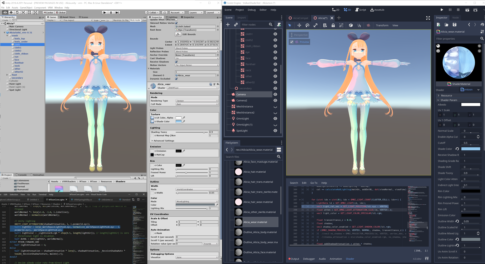
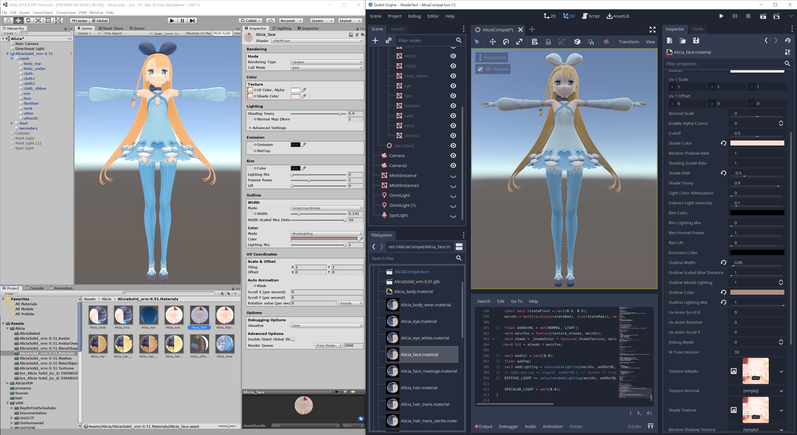

# MToon for Godot.
For use with VRM and as a basis for toon shaded models.

Based off the original MToon by Santarh at:

https://github.com/Santarh/MToon/tree/master/MToon/Resources/Shaders

Provided under the MIT License (see `LICENSE`)

The project opens the "compat" shader for 4.0 compatibility, but this shader
will not look correct. It's just to provide some simple shading with
compatible naming.

If you are in 3.2.x, please open the Alicia/Alicia.tscn to get the full shader.

## Versions:

### Godot-MToon-Shader (For Godot 3.2.2 - 3.2.x ONLY)

This version uses special GLSL macros defined in `custom_defines` (see DANGER below)
to provide the exact information needed to replicate the MToon look from Unity.

This shader should look identical to MToon in Unity. (NOTE: this test scene uses
realtime Omni and Spot lights, which are not compatible due to different falloff
curves. However, directional lights and ambient should look the same.)


NOTE: This shader ONLY supports Godot 3.2.2 or later, and only GLES3!

This shader will not work in Godot versions 3.2.1 or earlier; or master / 4.0.

#### DANGER: Project corruption godot bug

**NOTE: IMPORTING THIS SHADER WILL MODIFY YOUR PROJECT AND MAY INFECT OTHER .tres
OR .tscn ASSETS WHICH CONTAIN SHADERS. MAKE A BACKUP BEFORE IMPORTING.**

This shader will globally override the *maximum number of bones* allowed on a model.
Additionally, it will override the *maximum number of realtime lights* in a scene.
The numbers chosen are at the top of the `custom_defines` section, but they are
hardware dependent, so avoid making these too high. This is again due to unintended
use of a Godot feature, and mixing up global constants with per-shader defines.

This is due to a Godot bug (TODO: file bug) which causes `custom_defines` to modify the
global `spatial` or `canvas_item` shader objects in the engine, which are copied to newly
created shader resources.

If something goes wrong, be prepared to search all project assets within `.tres` or
`.tscn` textual files for `custom_shaders = ` lines and remove them.

As long as care is taken, this should be safe to import. But note that this shader
is using UNSUPPORTED behaviour of the Godot engine, and comes at NO WARRANTY.
The features may break at any time, and is more a preview of future tech than something
to use in a production project.

#### Uninstallation steps

**TO UNINSTALL THIS SHADER, YOU MUST REMOVE `custom_defines` FROM ALL ASSETS IN YOUR PROJECT**

You must use grep or another program to find all assets with `custom_defines`.

### MToonCompat-For-Godot-Master (For any Godot version)

**(Compatible with all Godot versions, but with incorrect ambient and directional lighting)**

This shader uses the same naming as MToon, and it should work in all versions of Godot.
However, proper toon shading is not possible without use of GLSL macros.

The compat shader may provide a PBR look:


While not the intent of MToon, this version exists to allow for compatibility
across all Godot versions, while still using the same MToon shader params so that
import and assets will be compatible.

This version will be needed until proper NPR support is implemented in Godot.

## Notes on usage:

This package provides several duplicate shaders depending on usecase:

- For opaque objects, use `mtoon.tres`
- For transparent objects, use `mtoon_trans.tres` or `mtoon_trans_zwrite.tres`
  for most transparent highlights.
- For cutout objects, use `mtoon.tres`, but set Enable Alpha Cutout to 1.

`_cull_off` tres variants are also provided to disable backface culling.

### To enable outlines.

For each material to outline, duplicate the material (or put all materials into a
folder and duplicate the folder).

Next, for each duplicate material, set the duplicate as the "Next Pass" of the original
materials. Finally, set the shader to `mtoon_outline.tres`

Note also: VRM provides a Unity-style render queue in the materials. Some materials may
need to have their "Render Priority" adjusted in Godot terms, in order to fix
transparency sorting.

## Feature parity / testing:

I may provide test projects in the future.
Tested features include rim light, Sphere Add (matcap), shading adjustments,
ambient GI (reflection probe), directional lights, omni lights, spot lights,
outlines with width texture, UV animations with mask, debug mode, shade
textures and shade color.

I have implemented this shader with PBR Directional light mode enabled. This is
controlled by this line:
```
//col = min(col, lit.rgb); // comment out if you want to PBR absolutely.
```
You can uncomment it if you desire the original (clamped directional light) behavior.

## TODO:

- Port this shader to Godot 4.0
- File PRs and issues against Godot 4.0 so that this can be done without GLSL macros.
- Test all baked lighting / voxel GI variants in Godot.

## Unsupported features/Bugs:

- Outlines in ScreenCoordinates mode. The screen pixel calculations seem resolution
dependent and I had difficulty ascertaining the intent of the original code.
- HDR color pickers for emission and rim colors, due to Godot limitations must be done
  using the Raw checkbox, but these colors will be **GAMMA CORRECTED** even in raw mode,
  due to a limitation in Godot. To compare, I suggest adding `[HDR][GAMMA]` in the Unity
  shader, or else remove `[HDR]` which also puts the colors into Gamma mode.
  In practice, a Gamma conversion calculator must be used when converting colors.
